# Chess Set — CAD Design in Fusion 360

> **Engineering Portfolio · Project 2**  
> **Author:** Kushagra Mishra

## Project Overview

This project documents the design of a complete, character-driven chess set in Autodesk Fusion 360. Each piece combines rotational solid modeling with custom detail, reference-based multi-body construction, and modular components designed for reliable assembly and 3D printing.

**Design focus:** expressive silhouettes, precise fits, manufacturable details, and functional features that distinguish the set from standard chess pieces.

## Goals

- Design a full, unique chess set — not just generic geometric pieces — with real character and detail.
- Give pieces attachable or modular components to add character and mechanical complexity (e.g. a hidden, removable sword inside the king, attachable shield, lookout tower, or cape).
- Learn and apply Fusion 360 skills well beyond basic revolve: patterning, offset planes, projection, and tangent-plane sketching.
- Design multi-body parts so separately-built pieces fit together accurately — carrying forward the alignment lesson learned from the screwdriver project.
- Push creativity in silhouette, proportion, and detail across five distinct piece types.
## Pieces Made

Five piece types were designed: King, Queen, Rook, Bishop (“muni”), and Pawn. Difficulty, from most to least complex:

- Queen — hardest: tangent-plane dress slits, silhouette-matched shell, custom platform fit, complex patterns fit onto partial surfaces
- Rook — crenellated crown, projected “gear-style” lookout floor
- King — disk crown, hidden/removable sword mechanism
- Pawn — layered ring body, simple shield add-on
- Bishop (“Muni”) — simplest of the set
## Technique Breakdown

Rather than walking through each piece top to bottom, this notebook is organized by technique, since most pieces reused and built on the same core skills. The Queen and King are called out individually where they pushed a technique the furthest.

### 1. Revolve — Solid of Revolution

Every piece's main body started as a 2D profile revolved 360° around a center axis — the same principle as the calculus “solid of revolution” / disc method. This was the foundation for the king, queen, rook, bishop, and pawn bodies.

### 2. Multi-Body Design with Reference-Based Fit

The screwdriver project (Model 1) failed because pieces were modeled in separate files and their features didn't align. For the chess set, every piece was built as multiple bodies inside one file, using an existing body as a direct reference when designing the mating piece — instead of guessing dimensions or keeping track of them across multiple files. This is the single biggest lesson carried over between the two projects, and it shows up in nearly every piece:

- Rook: the crenellated crown and the “gear-style” lookout floor were built to key into each other exactly.
- King: the crown was built off the body using projection + an offset plane so it seats precisely.
- Queen: the outer dress shell was built by projecting the body's silhouette, guaranteeing a perfect, click-fit match.
### 3. Circular Patterning

Used to generate the repeating crenellations on the rook's crown and the king's crown, patterning a single detail feature around the center axis instead of modeling each one individually. For Queen, the different layers of shell were modeled and rotated 180 degrees so the patterns on the shell had to be manually adjusted, testing between 160 – 180 degrees to complete a full pattern on the shell using circular patterning.

Many of the pieces had intricate patterns – windows on the rook’s top made by creating small arches extruded into the body, sun design on pawn’s shield, queen’s collar, slits in the dress, rings around the body of pawn and queen, and crowns on top of queen and king,

### 4. Curved Holes Matching Cylinder Geometry (Bishop Arms)

The bishop (“Muni”) needed side holes for the arms to plug into the cylindrical body, but a straight, flat hole would not sit flush against a curved surface. To get a seamless fit, the holes were cut to match the curvature of the cylinder itself rather than projecting a flat circular cut, so the arm pieces meet the body without a visible gap or step at the joint.

### 5. Offset Planes + Projection for Detail Features

This combination — creating a plane offset from an existing face, then projecting geometry onto it — was used repeatedly to cut or build features that key into another part:

- Rook: an offset plane plus a top-view projection created a “gear-style” lookout floor that fits inside the crenellated walls.
- King: an offset plane plus projection aligned the crown to the body, and the same approach carved the internal slot that holds the sword.
- Queen: an offset plane was used to lay out the dress slits before extruding them (see Technique 6).
### 6. Tangent-Plane Sketching on Non-Parallel Surfaces

The queen's dress slits required sketching and extruding on a surface that isn't parallel to the set xy plane — using a tangent plane to sketch directly on the curved, angled surface of the dress. This was the most advanced technique used throughout the whole project. One slit came out slightly off because it was drafted under 0.1″, which is discussed in Problems below, but the technique itself worked as intended.

### 7. Silhouette Projection for Shell-Matching

For the queen, the body was modeled first, then its outline was projected onto a new sketch to build an outer “dress” shell that traces the body's curves and corners exactly. Because the shell is generated directly from the body's own silhouette rather than estimated by eye, the two parts click together with an audible click, creating a precise fit.

### 8. Platform Extrusion for Seating a Body

A sketch and extrusion were used to build a small platform at the base of the queen's shell, so the body has a defined seat to rest on inside the dress, completing the click-fit assembly. The same method was used for the rook's lookout tower, which was built on top of the existing body.

### 9. Modular / Removable Components

The king's disk-topped crown hides a removable sword inside it, built as its own body with a slot that lets it seat securely and lift out cleanly. This directly addresses the modular-component goal and adds a functional, movable element. The pawn's attachable shield, queen's click-fit cape, and rook's buildable lookout tower similarly differentiate these pieces from standard chess designs.

## Problems and Successes

### Problems

- Several fine features — most notably one of the queen's dress slits — were designed under 0.1 in, which is close to the practical minimum feature size for FDM printing. That slit did not fully resolve on the print; the defect is barely noticeable but present.
- As a full five-piece set with several multi-body assemblies, the project took considerably longer to design correctly than the single-part screwdriver iterations. More time should be spent designing and sketching complex pieces before the build phase.
- Did not make a knight as I believed it would only be a test of my sketching skills and could not find a creative way to make one.
### Successes

- The reference-based multi-body technique carried over from the screwdriver project worked — pieces built and printed separately (queen body/shell, king crown/body, rook crown/floor) fit together correctly, including a real click-fit on the queen.
- Successfully executed a functional modular feature (the king's removable sword) rather than just a static model.
- Progressed from basic revolve and fillet work on the screwdriver to tangent-plane sketching, silhouette-based shell design, and multi-body integration for compatible parts.
## New Skills Learned

- Tangent-plane sketching on curved, non-parallel surfaces
- Silhouette/edge projection to generate a matching outer shell from an existing body
- Offset planes combined with projection for keyed detail features
- Circular patterning for repeating detail (crenellations)
- Designing intentional modular/removable sub-assemblies
## Overall Fusion 360 Skill Summary

Combining both the screwdriver and chess set projects, here is a clean list of what's been demonstrated so far after one week in Fusion 360:

- Sketching: 2D profile sketching, sketching on offset/tangent/non-principal planes
- Solid modeling: Revolve, Extrude, Fillet/Chamfer
- Multi-body workflow: creating, hiding, moving, and joining multiple bodies in one file; using one body as live reference geometry for another
- Patterning: circular pattern for repeating detail
- Reference geometry: offset planes, projected geometry/silhouettes
- Design for additive manufacturing: iterative print-and-revise process, awareness of tolerance/clearance and minimum feature size
## CAD Files

The source Fusion 360 models are included in this repository:

- [King](<chess- king.f3d>)
- [Queen](<chess - queen.f3d>)
- [Rook](rook.f3d)
- [Muni / Bishop](<Chess- muni.f3d>)
- [Pawn](chess- pawn.f3d)

The final designs combine decorative detail with removable or attachable features. Images below are extracted from the original portfolio document.

| Design | Detail |
|---|---|
| Rook — lookout tower on top of a cylindrical body, with small windows patterned around the piece  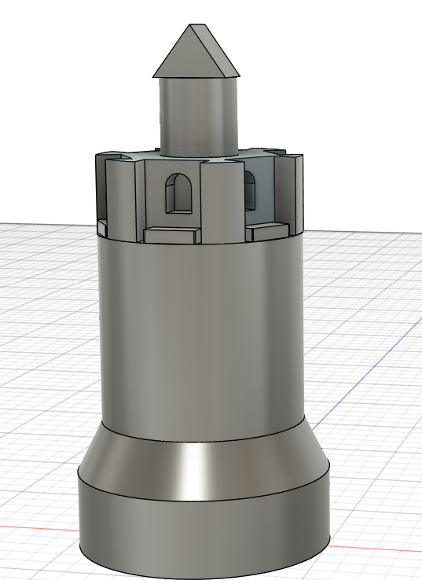  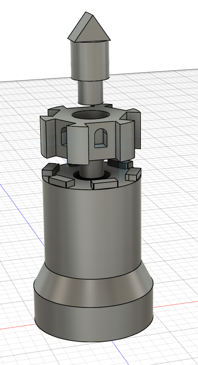 | Pawn — sun design on a removable shield. The shield was glued to a pin after printing; a small divot on its underside keeps the shield centered during assembly.  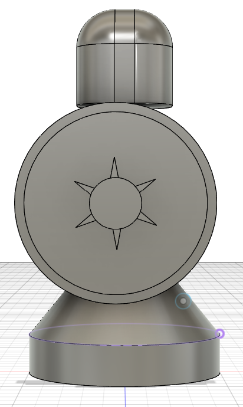  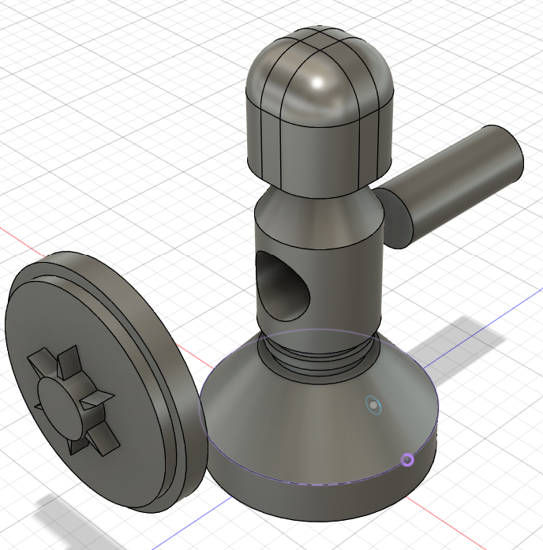 |
| King — disk crown with removable sword body  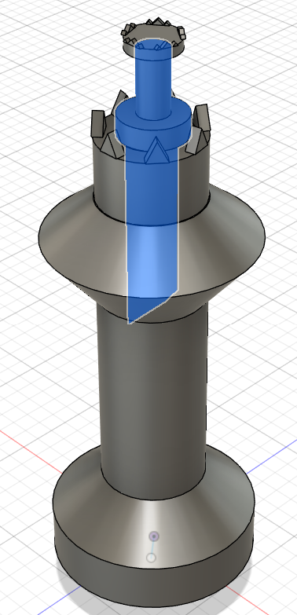  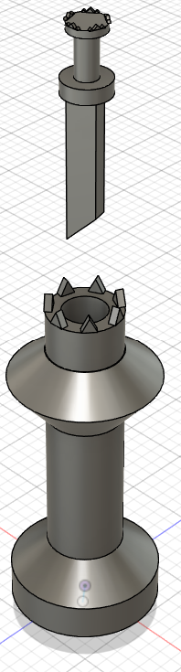 | Queen — click-fit outer shell representing a decorated cape, plus an attachable crown  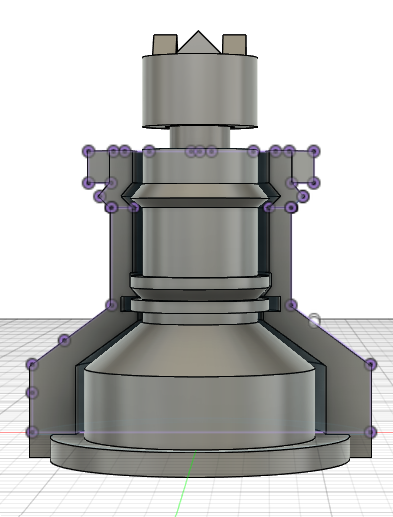  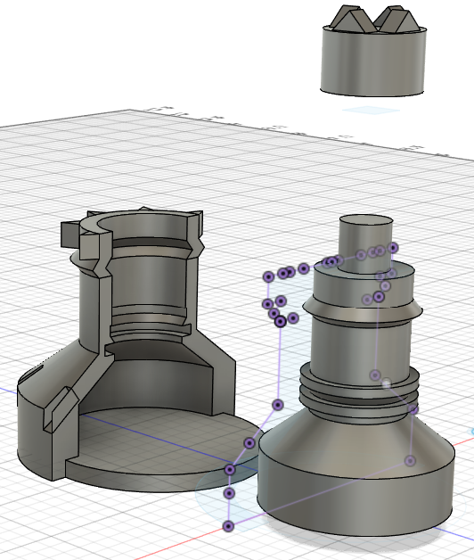  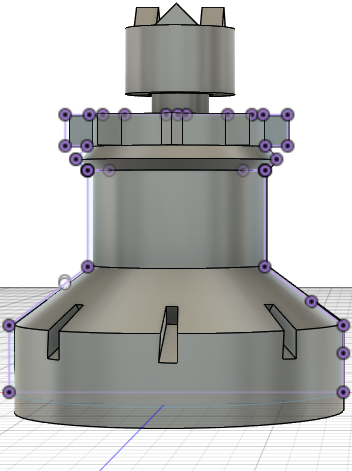 |
| Muni / Bishop — cylindrical body with curved arm openings for a seamless fit  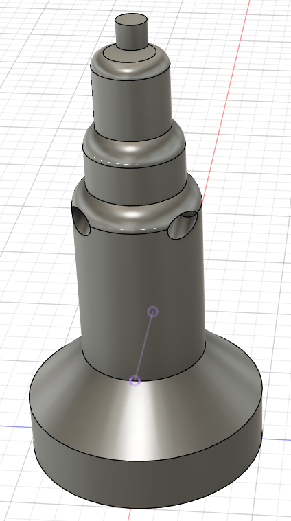  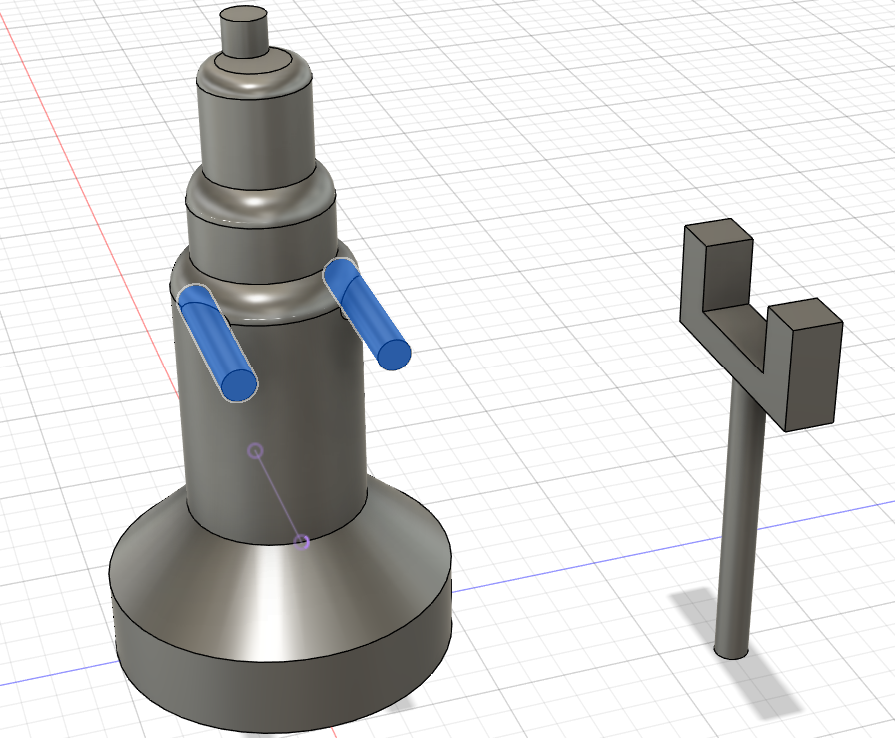 |  |
